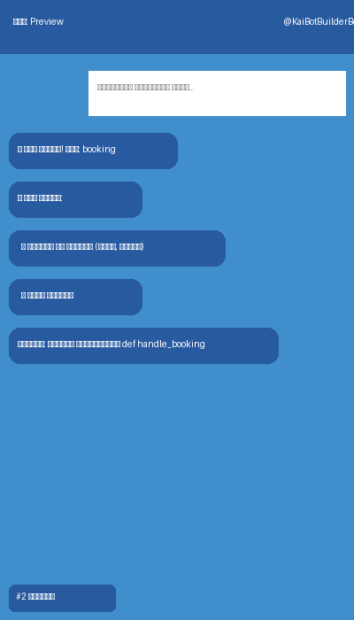

# Kai Bot Builder

Public product surface for **Kai Bot Builder** — a Telegram service that creates bots from plain-text descriptions.

> Describe the bot you need, review the generated preview, paste your BotFather token, and get a live Telegram bot.

## Live product

- **Bot:** https://t.me/KaiAiBotBuilderBot?start=direct
- **Public landing page:** https://kai-agi.com/chast/bot-builder/

## What it does

Kai Bot Builder is aimed at simple-to-medium Telegram bots such as:

- lead / contact form bots
- FAQ bots
- appointment booking bots
- simple reminder / notification bots

## How it works

1. User sends a plain-language description to `@KaiAiBotBuilderBot`
2. The system generates a preview first
3. User pastes a BotFather token
4. The bot is deployed and hosted

## Pricing

- First **3 bots free**
- Then **990₽ / month per bot**
- Billing via Telegram Stars

## Limits

- Requires a free BotFather token
- Generation takes about a minute
- Best suited for simple-to-medium complexity bots

## What this repository is

This repository is the **public acquisition / product page surface** for Kai Bot Builder.
It exists so the product has a real public GitHub URL with honest metadata, README, assets, and landing-page source.

Included here:

- public product README
- public landing-page source (`site/index.html`)
- public logo and promo asset samples

## What this repository is not

This is **not** the full private production system and **not** a self-hostable open-source release.
The private runtime currently lives inside the internal `kai-system` repo and depends on private infrastructure.

So:

- this repo is a **public product/demo/docs surface**
- it is **not yet** an open-source self-hosted package
- awesome-selfhosted / source-first lists should wait for a genuinely public runnable release

## Public assets

## Topics / discovery intent

This repo is meant to support:

- GitHub search and topic discovery
- links from articles and directory submissions
- a public artifact for future product pages and comparisons

It does **not** by itself make the product eligible for source-first open-source lists.
